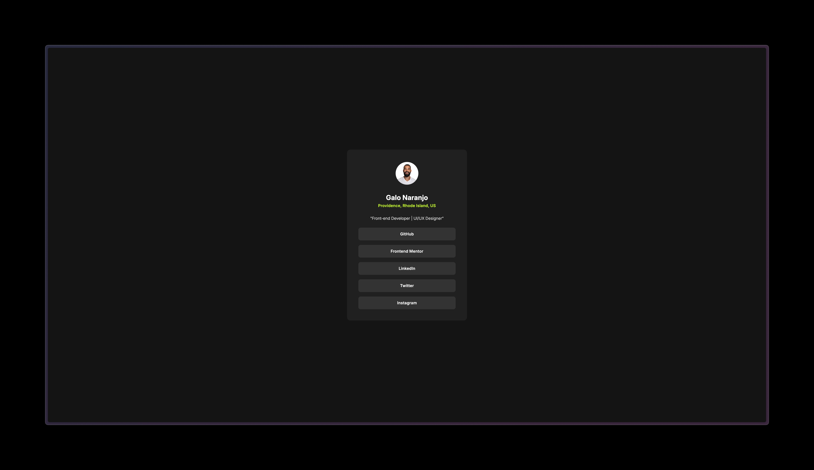

# Frontend Mentor - Blog preview card solution

This is a solution to the [Blog preview card challenge on Frontend Mentor](https://www.frontendmentor.io/challenges/blog-preview-card-ckPaj01IcS). Frontend Mentor challenges help you improve your coding skills by building realistic projects.

## Table of contents

- [Screenshot](#screenshot)
- [Links](#links)
- [Built with](#built-with)
- [What I learned](#what-i-learned)
- [Continued development](#continued-development)
- [Author](#author)

### Screenshot



### Links

- Solution URL: [GitHub](https://github.com/galonaranjo/social-links)
- Live Site URL: [Vercel](https://findgalo.vercel.app/)

### Built with

- Semantic HTML5 markup
- CSS custom properties
- Flexbox

### What I learned

Had a lot of fun playing and understanding transitions (cubic beziers, anyone?) and hover states. Understanding placement of links so that an entire div and all of its children are clickable. Getting comfortable with pseudo selectors

```
.link-wrapper {
  height: fit-content;
  vertical-align: middle;
  background-color: #333333;
  border-radius: 8px;
  margin-bottom: 16px;
  transition: 0.6s cubic-bezier(0.645, 0.045, 0.355, 1);
}

a:first-of-type .link-wrapper {
  margin-top: 24px;
}

a:last-child .link-wrapper {
  margin-bottom: 0px;
}

.link-wrapper:hover {
  background-color: #c4f82a;
  color: #333333;
  transition: 0.6s cubic-bezier(0.645, 0.045, 0.355, 1);
  cursor: pointer;
}

```

### Continued development

This is helping me understand the importance of components within a design system. Being well-versed in Figma allows me to quickly refer to the design and get a feel for what a real-life transition might be like.

## Author

- Website - [Galo Naranjo](https://github.com/galonaranjo)
- Frontend Mentor - [@galonaranjo](https://www.frontendmentor.io/profile/galonaranjo)
- Twitter - [@galonaranjo\_](https://www.twitter.com/galonaranjo_)
